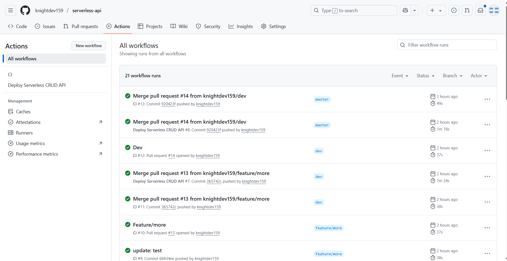
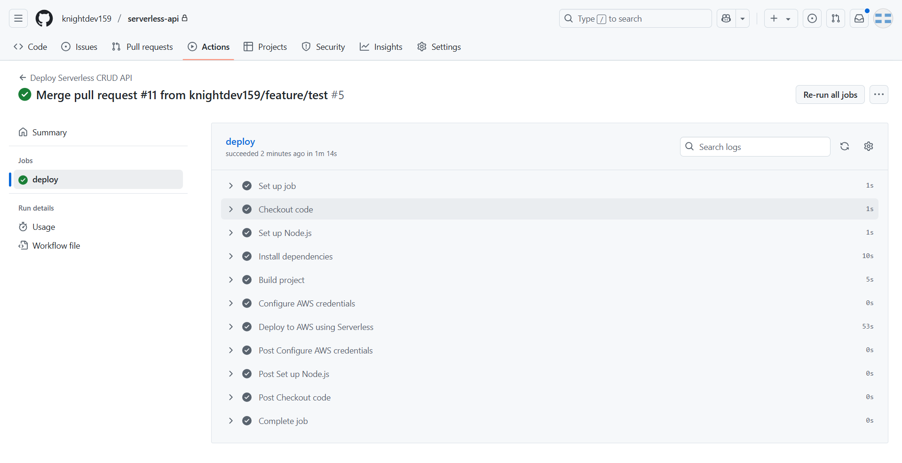
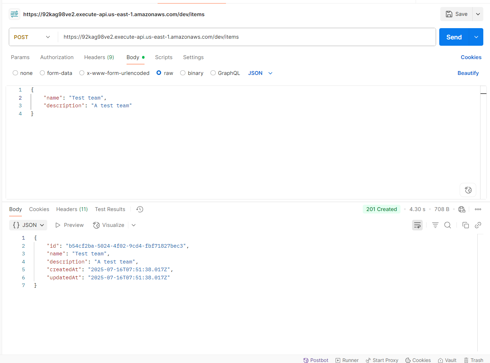

# Coffee Shop Menu API (Serverless CRUD, AWS)

This project is a Serverless Framework-based REST API for managing a coffee shop menu, using AWS API Gateway, Lambda (Node.js/TypeScript), and DynamoDB. It supports full CRUD operations for menu items and is ready for CI/CD deployment.

## Business Case
This API powers a coffee shop’s menu management. You can create, read, update, and delete menu items (e.g., drinks, pastries) with fields like name, price, category, and availability.

## Features
- Node.js/TypeScript Lambdas
- AWS API Gateway REST API
- DynamoDB integration (no direct service proxy)
- Serverless Framework IaC (modular YAML)
- GitHub Actions CI/CD (multi-stage: dev, prod)
- Helper scripts for deployment and testing
- Unit tests for all handlers

## Folder Structure
```
serverless/
  src/
    handlers/   # Lambda function handlers
    models/     # TypeScript interfaces/models
    services/   # Business logic, DynamoDB access
  tests/        # Unit tests
  scripts/      # Helper scripts (deploy, test)
  serverless.yml
  serverless/functions.yml
  serverless/resources.yml
  README.md
```

## MenuItem Model
```ts
export interface MenuItem {
  id: string;
  name: string;
  description?: string;
  price: number;
  category: string; // e.g., "coffee", "tea", "pastry"
  available: boolean;
  createdAt: string;
  updatedAt?: string;
}
```

## Getting Started

### Prerequisites
- Node.js 18+
- AWS account with permissions for Lambda, API Gateway, and DynamoDB
- Serverless Framework (`npm install -g serverless`)

### Setup
1. Clone the repository
2. Install dependencies:
   ```sh
   npm install
   ```
3. Build the project:
   ```sh
   npm run build
   ```

### Deploy Manually
Deploy to dev stage:
```sh
npm run deploy:dev
```
Deploy to prod stage:
```sh
npm run deploy:prod
```
Or use the helper script:
```sh
./scripts/deploy.sh [stage]
```

### Run Tests
```sh
npm test
# or
./scripts/test.sh
```

## API Endpoints
| Method | Path         | Description                |
|--------|--------------|----------------------------|
| POST   | /items       | Create a menu item         |
| GET    | /items       | List all menu items        |
| GET    | /items/{id}  | Get menu item by ID        |
| PUT    | /items/{id}  | Update menu item by ID     |
| DELETE | /items/{id}  | Delete menu item by ID     |

#### Example Request (Create Menu Item)
```sh
curl -X POST https://<api-id>.execute-api.<region>.amazonaws.com/dev/items \
  -H "Content-Type: application/json" \
  -d '{"name": "Latte", "price": 4.5, "category": "coffee", "available": true}'
```

## Infrastructure as Code (IaC)
- All AWS resources and functions are defined in modular YAML files:
  - `serverless.yml` (main config)
  - `serverless/functions.yml` (Lambdas)
  - `serverless/resources.yml` (DynamoDB)
- Lambda packaging is optimized (excludes dev dependencies, tests, docs, etc.)

## Helper Scripts
- `scripts/deploy.sh [stage]` — Build and deploy to a specified stage (default: dev)
- `scripts/test.sh` — Run all tests

## CI/CD with GitHub Actions

This project uses GitHub Actions to deploy automatically:
- Push to `dev` branch → deploys to `dev` stage
- Push to `master` branch → deploys to `prod` stage

### Setup GitHub Secrets
Add these secrets to your GitHub repository:
- `AWS_ACCESS_KEY_ID`
- `AWS_SECRET_ACCESS_KEY`
- `SERVERLESS_ACCESS_KEY`

## Screenshots

### 1. GitHub Actions Workflow Overview


### 2. Deploy Workflow Step Details


### 3. AWS Lambda Console


### 4. AWS API Gateway Console


### 5. AWS DynamoDB Table


### 6. API Test (Postman)


## Loom Video
Insert your Loom video walkthrough link here.
