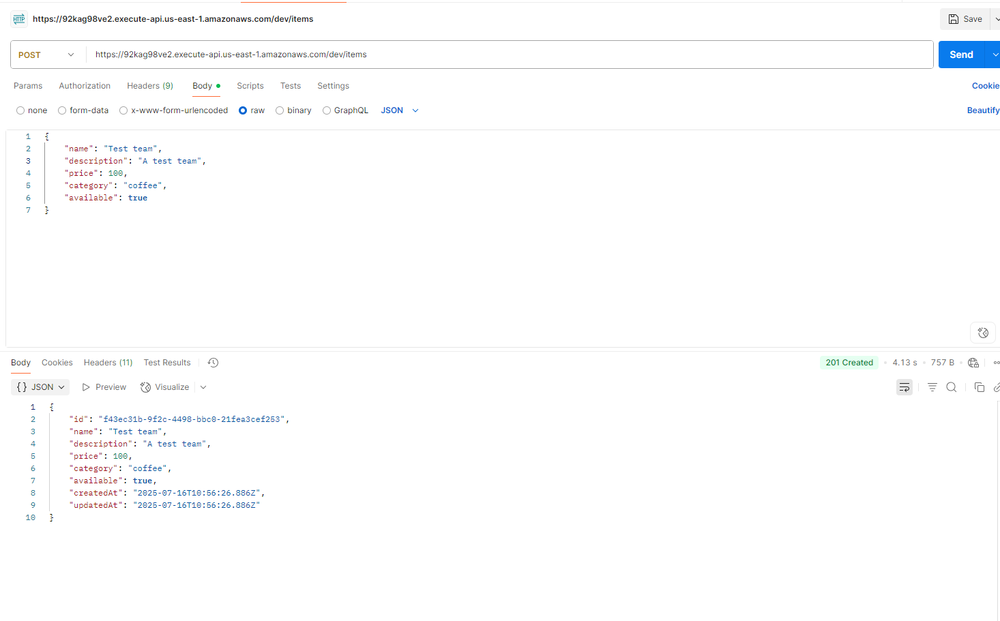

# Serverless CRUD REST API (AWS)

This project is a Serverless Framework-based REST API using AWS API Gateway, Lambda (Node.js/TypeScript), and DynamoDB. It supports full CRUD operations and is ready for CI/CD deployment.

## Features
- Node.js/TypeScript Lambdas
- AWS API Gateway REST API
- DynamoDB integration (no direct service proxy)
- Serverless Framework IaC
- GitHub Actions CI/CD (multi-stage: dev, prod)

## Folder Structure
```
serverless/
  src/
    handlers/   # Lambda function handlers
    models/     # TypeScript interfaces/models
    services/   # Business logic, DynamoDB access
  README.md
  serverless.yml
```


## Getting Started

### Prerequisites
- Node.js 18+
- AWS account with permissions for Lambda, API Gateway, and DynamoDB
- Serverless Framework (`npm install -g serverless`)

### Setup
1. Clone the repository
2. Install dependencies:
   ```sh
   npm install
   ```
3. Build the project:
   ```sh
   npm run build
   ```

### Deploy Manually
Deploy to dev stage:
```sh
npm run deploy:dev
```
Deploy to prod stage:
```sh
npm run deploy:prod
```

### API Endpoints
| Method | Path         | Description         |
|--------|--------------|---------------------|
| POST   | /items       | Create an item      |
| GET    | /items       | List all items      |
| GET    | /items/{id}  | Get item by ID      |
| PUT    | /items/{id}  | Update item by ID   |
| DELETE | /items/{id}  | Delete item by ID   |

#### Example Request (Create Item)
```sh
curl -X POST https://<api-id>.execute-api.<region>.amazonaws.com/dev/items \
  -H "Content-Type: application/json" \
  -d '{"name": "Test Item", "description": "A test item"}'
```

## CI/CD with GitHub Actions

This project uses GitHub Actions to deploy automatically:
- Push to `dev` branch → deploys to `dev` stage
- Push to `master` branch → deploys to `prod` stage

### Setup GitHub Secrets
Add these secrets to your GitHub repository:
- `AWS_ACCESS_KEY_ID`
- `AWS_SECRET_ACCESS_KEY`

## Screenshots

### 1. GitHub Actions Workflow Overview


### 2. Deploy Workflow Step Details


### 3. AWS Lambda Console


### 4. AWS API Gateway Console


### 5. AWS DynamoDB Table


### 6. API Test (Postman)


## Loom Video
Insert your Loom video walkthrough link here.
